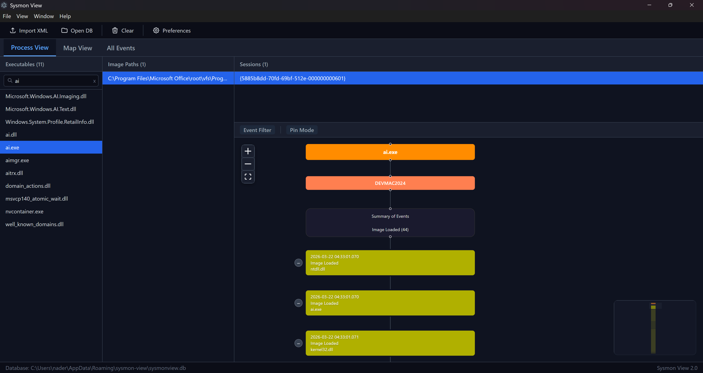
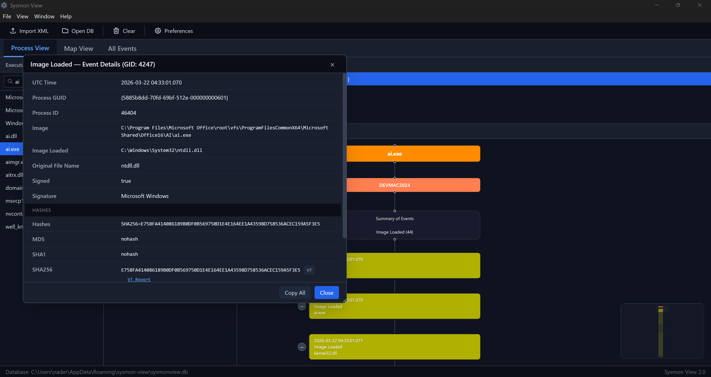
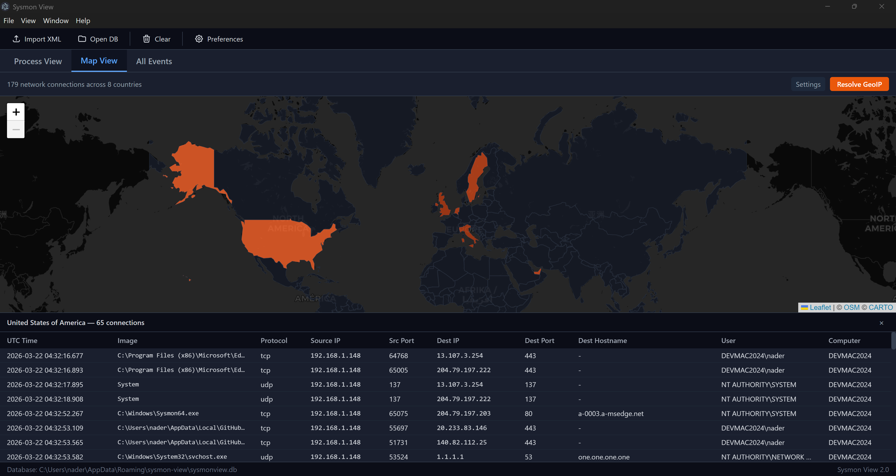
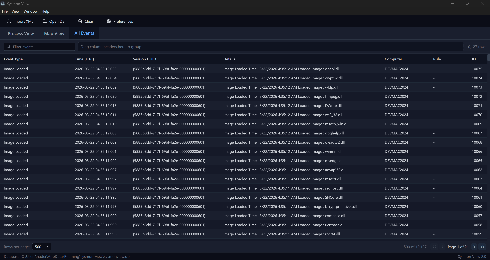
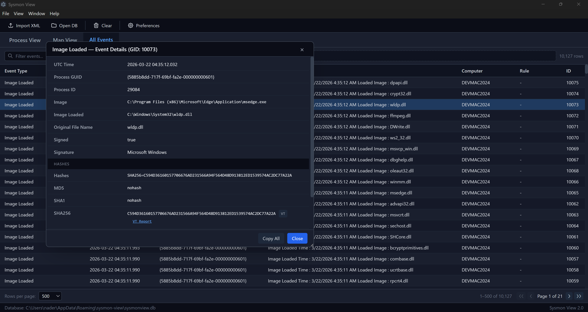

# Sysmon Tools

[](https://www.gnu.org/licenses/gpl-3.0)


[](https://github.com/sponsors/nshalabi)

A collection of utilities for analyzing, visualizing, and managing **Microsoft Sysmon** logs — designed for security analysts, DFIR specialists, and threat hunters.

---

## What's New in v2.0

Sysmon View has been **rewritten from the ground up** as a fully open-source desktop application — a long-requested change by the community. Built with **Electron + React + TypeScript**, the entire codebase is now open and free of commercial dependencies.

**Key improvements:**

- Modern dark-themed UI with a streamlined analyst workflow
- Interactive session diagrams with freedom to move and arrange nodes
- **Collapsible nodes** — collapse/expand sections of the event chain for focused analysis
- **Event type filtering** — show/hide specific event types for a zoomed-in view of what matters
- **Pin mode** — pin events of interest and filter to show only pinned events with configurable context range
- **Performance optimization** — server-side pagination for large datasets, session threshold protection for diagram rendering
- Hierarchical grouping in All Events — drag columns to group by machine, event type, session GUID, or any combination
- Direct VirusTotal report links for hashes and IP addresses (no API key required for basic lookups)
- GeoIP map view with multiple provider support
- Cross-platform potential (Windows first, macOS/Linux possible)

---

## Content

- [Sysmon View](#sysmon-view)
- [Getting Started](#getting-started)
- [Building from Source](#building-from-source)
- [Legacy Tools](#legacy-tools)
- [Third-Party Libraries](#third-party-libraries)
- [Support the Project](#support-the-project)
- [License](#license)
- [Contact](#contact)

---

## Sysmon View

Sysmon View helps track and visualize Sysmon logs by logically grouping and correlating events. It uses executables, session GUIDs, event creation times, and more to organize data into multiple views.



### Process View

Summarizes run sessions per process GUID and shows correlated events in an interactive session diagram. Each node represents a Sysmon event, color-coded by type, displaying the field of interest (command lines, network connections, loaded images, registry keys, etc.).

- **Collapsible nodes** — collapse/expand sections of the event chain to focus on what matters
- **Event type filter** — show/hide specific event types (e.g., hide Image Loaded to focus on network events)
- **Pin mode** — pin important nodes and filter to show only pinned events with configurable context range
- **Session threshold** — sessions with over 2,000 events redirect to All Events for performance



### Map View

Geo-locates network destinations using configurable GeoIP providers and plots them on an interactive map. Click any marker to pivot into correlated events for that destination.



### All Events View

Full search through all collected data with server-side pagination for large datasets. Supports hierarchical grouping — drag column headers to the group zone to organize by machine, event type, session GUID, or any combination.



### Event Details

Double-click any event to open a detail panel showing all fields from the event-specific table. Includes direct links to VirusTotal reports for hashes (MD5, SHA1, SHA256) and IP addresses.



### Additional Features

- VirusTotal API integration for hash and IP lookups (requires API key for detailed results)
- Direct VT report links (no API key required) for quick browser-based analysis
- Export Sysmon XML logs from Windows Event Log and import into Sysmon View
- SQLite database backend — portable, shareable, and queryable with any SQLite tool

---

## Getting Started

### Download

Download the latest release from the [Releases](https://github.com/nshalabi/SysmonTools/releases) page:

- **Installer** — `Sysmon View Setup x.x.x.exe` (recommended)
- **Portable** — `SysmonView-x.x.x-portable.exe` (no installation required)

### Export Sysmon Logs

Export Sysmon events to XML using `WEVTUtil`:

```powershell
WEVTUtil query-events "Microsoft-Windows-Sysmon/Operational" /format:xml /e:sysmonview > eventlog.xml
```

### Import into Sysmon View

1. Launch Sysmon View
2. Go to **File > Import XML Logs** and select one or more exported XML files
3. Events are parsed and stored in a local SQLite database
4. Navigate between Process View, Map View, and All Events to analyze the data

The database is stored under your user application data folder and can be shared or backed up.

---

## Building from Source

### Prerequisites

- [Node.js](https://nodejs.org/) v18 or later
- [Git](https://git-scm.com/)

### Development

```bash
git clone https://github.com/nshalabi/SysmonTools.git
cd SysmonTools/SysmonView
npm install
npm run dev
```

### Production Build

```bash
cd SysmonTools/SysmonView
npm install
npm run build
```

The installer and portable executable will be generated in the `SysmonView/release/` directory.

---

## Legacy Tools

Previous versions of Sysmon Tools are archived in the [`Legacy/`](Legacy/) directory:

- **Sysmon View v3.1** — the original desktop application
- **Sysmon Shell** — GUI configuration editor for Sysmon XML configs
- **Sysmon Box** — command-line utility to capture and correlate Sysmon + network events

These tools are provided as-is for reference. New versions may be added to this repository as they are rewritten.

---

## Third-Party Libraries

Sysmon View is built with open-source libraries including React, Electron, React Flow, TanStack Table, Leaflet, sql.js, and others. See [THIRD_PARTY_NOTICES.md](SysmonView/THIRD_PARTY_NOTICES.md) for the full list with license details.

---

## Support the Project

If you find Sysmon Tools useful in your work, consider supporting its continued development:

- [GitHub Sponsors](https://github.com/sponsors/nshalabi)

Your support helps keep the project maintained, open source, and free for the community.

---

## License

This project is licensed under the [GNU General Public License v3.0](https://www.gnu.org/licenses/gpl-3.0.en.html).

---

## Contact

- GitHub: [github.com/nshalabi/SysmonTools](https://github.com/nshalabi/SysmonTools)
- X (Twitter): [x.com/nader_shalabi](https://x.com/nader_shalabi)
- LinkedIn: [linkedin.com/in/nadershalabi](https://www.linkedin.com/in/nadershalabi)

For issues or feature requests, please [open an issue](https://github.com/nshalabi/SysmonTools/issues).
